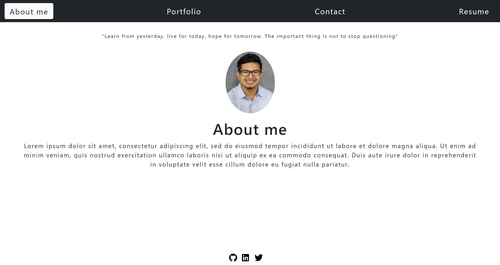

# react-portfolio

## Description 
  This application generates a portfolio webpage using react, js and css. Upon visiting the user can view the different information available base on the selection of the nav bar. Visitors are able to view each projects code or deployed version. Also a copy of my resume can be downloaded in the contact me section.

   A screenshot of the deployed application is attached below.

   This application can be found at the following link.
   
   REPLACE LINK HERE

  
  ## Table of Contents
  - [Description](#description)
  - [Installation](#installation)
  - [Usage](#usage)
  - [License](#license)
  - [Questions](#questions)

  ## Installation 
  - Use a Termal or GitBash
  - Install react
    - npx create-react-app <app-name>
  - Use any compatible text editor
  - Clone or fork this repository to desired workstation

  ## Usage 
  Start the application by calling the file npm start in either Terminal or GitBash. From there the user can view the following sections: about me, projects, contact, resume. Each of the projects has a link to view the code and live version. User can also leave their info in the contact me if they wish to reach me.

  
  
  
  ## License
  - This project is under the [MIT](https://opensource.org/licenses/MIT) license. 

  ## Questions
  - Feel free to reach me via GitHub or Email with any questions regarding this project
  - GitHub: [georgedmendoza](https://github.com/georgedmendoza)
  - Email: [georgedmendoza13@gmail.com](mailto:georgedmendoza13@gmail.com)

